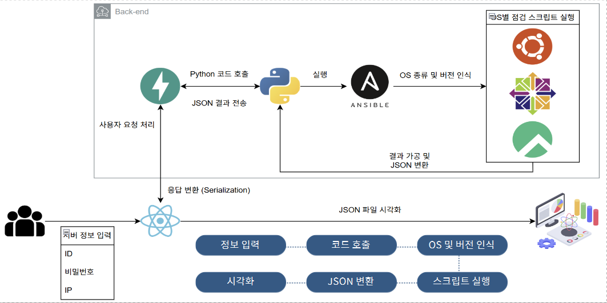

# 🛡️ OneClickSecure (OCS)

---

## 📌 프로젝트 개요

### 프로젝트 목표

**KISA 주요정보통신기반시설 취약점 점검 가이드라인을 기반으로 한 Unix/Linux 서버 보안 자동 점검 시스템 구축**

```
✅ 80+ 보안 점검 항목 자동화
✅ Ansible을 통한 다중 서버 동시 점검
✅ Ubuntu, CentOS, Rocky Linux 지원
✅ 웹 기반 GUI 및 CSV 자동 리포팅
```

### 해결하고자 한 문제

| 기존 문제점 | OneClickSecure 솔루션 |
|------------|---------------------|
| ⏰ **점검 시간 과다 소요** | → **자동화로 점검 시간 대폭 단축** |
| 🔄 **매번 동일한 수작업 점검** | → **스크립트 1회 실행으로 완료** |
| 📄 **수기 문서화의 비효율성** | → **CSV 자동 생성 및 다운로드** |
| 🎯 **점검자마다 결과 편차** | → **표준화된 스크립트로 일관성 보장** |
| 📈 **다수 서버 점검의 확장성 한계** | → **다중 호스트 병렬 처리** |

### 핵심 특징

- **🤖 Agentless 아키텍처**: 대상 서버에 별도 에이전트 설치 불필요 (Ansible 기반)
- **🔍 KISA 가이드라인 완벽 준수**: 주요정보통신기반시설 취약점 점검 항목 구현
- **🌐 다중 OS 지원**: Ubuntu 18.04/24.04, CentOS 7, Rocky Linux 9.6
- **📊 실시간 모니터링**: 점검 진행 상황 및 결과 시각화
- **🔒 보안 강화**: YAML 플레이북 보안 검증 및 감사 로그

---

## 🎓 교육 과정 배경

### K-Shield Jr. 보안 교육 과정

본 프로젝트는 **한국인터넷진흥원(KISA)**의 **K-Shield 주니어** 교육 과정 최종 팀 프로젝트입니다.

#### 교육 내용과 프로젝트의 연계

```
K-Shield Jr. 학습 내용
├── Unix/Linux 보안 점검 방법론
├── KISA 취약점 점검 가이드라인
├── Shell Script & Python 스크립트 작성
└── 보안 진단 및 보고서 작성
            ⬇️
OneClickSecure 프로젝트
├── 80+ 보안 항목 실무 구현
├── Ansible 자동화 적용
├── 웹 기반 시각화 및 리포팅
└── 실전 포트폴리오 구축
```

---

## 🎯 주요 기능

### 1️⃣ 자동화된 보안 점검

**KISA 주요정보통신기반시설 가이드라인 기반 80+ 항목 자동 점검**

| 점검 영역 | 항목 수 | 주요 내용 |
|----------|---------|----------|
| 🔐 **계정 관리** | 15개 | root 원격 접속 제한, 패스워드 정책, 불필요 계정 |
| 📁 **파일/디렉터리** | 20개 | /etc/passwd, /etc/shadow 권한, 파일 소유권 |
| 🌐 **서비스 관리** | 25개 | 불필요 서비스, 포트 점검, 방화벽 설정 |
| 🔄 **패치 관리** | 10개 | 최신 보안 패치 적용 여부 |
| 📝 **로그/감사** | 10개 | 로그 설정, Session Timeout, 감사 기록 |

### 2️⃣ 다중 OS 지원

<table>
<tr>
<th>OS</th>
<th>지원 버전</th>
<th>스크립트 언어</th>
<th>점검 항목</th>
</tr>
<tr>
<td>🐧 Ubuntu</td>
<td>18.04, 24.04</td>
<td>Python 2.7</td>
<td>73+ 항목</td>
</tr>
<tr>
<td>🔶 CentOS</td>
<td>7</td>
<td>Shell Script</td>
<td>70+ 항목</td>
</tr>
<tr>
<td>🔷 Rocky Linux</td>
<td>9.5, 9.6</td>
<td>Python 2.7, Shell</td>
<td>75+ 항목</td>
</tr>
</table>

**자동 OS 감지**: Ansible `setup` 모듈을 통한 실시간 인식 및 최적 스크립트 선택

### 3️⃣ 대규모 인프라 관리

- 📡 **다중 호스트 병렬 점검**: 여러 서버 동시 점검 지원
- 🎛️ **선택적 항목 실행**: 섹션별 체크박스로 원하는 항목만 점검
- 📊 **실시간 모니터링**: 점검 진행 상황 및 결과 실시간 확인
- 📥 **자동 리포팅**: CSV 파일 자동 생성 및 다운로드

### 4️⃣ 보안 강화 기능

#### YAML 플레이북 보안 검증

```python
security_rules = {
    "dangerous_commands": [
        r"rm\s+-rf",        # 강제 삭제 명령
        r"dd\s+if=",        # 디스크 덮어쓰기
        r"mkfs\.",          # 파일시스템 포맷
        r"shutdown|reboot", # 시스템 종료
    ],
    "dangerous_paths": [
        r"/etc/shadow",     # 비밀번호 해시
        r"/etc/passwd",     # 사용자 정보
        r"/root/",          # Root 디렉터리
    ]
}
```

#### 감사 로그 (Audit Log)

- ✅ 모든 점검 실행 이력 추적
- ✅ 사용자 행위 기록
- ✅ 컴플라이언스 대응 증적 자료

### 5️⃣ 웹 기반 사용자 인터페이스

- 🖥️ **대시보드**: 전체 호스트 현황, 플레이북 상태, 작업 히스토리
- ➕ **호스트 관리**: 간편한 서버 등록 (이름, IP, 인증 정보)
- 📤 **커스텀 스크립트 업로드**: `.sh`, `.py`, `.yml` 파일 지원
- 🔧 **내장 YAML 에디터**: 실시간 문법 검증
- 📊 **작업 히스토리**: 과거 점검 결과 조회 및 비교

---

## 🏗️ 시스템 아키텍처

<div align="center">
  
</div>

### 시스템 구성도

OneClickSecure는 **사용자 인터페이스 → 백엔드 API → 자동화 엔진 → 점검 대상 서버**로 이어지는 4계층 아키텍처를 기반으로 합니다.

#### 📥 1단계: 사용자 입력
- 호스트 정보 입력 (ID, 비밀번호, IP)
- 점검 항목 선택

#### 🎨 2단계: Frontend (React)
- 정보 입력 인터페이스 제공
- JSON 직렬화 (Serialization)
- 사용자 요청 처리

#### ⚙️ 3단계: Backend (FastAPI)
- **정보 입력**: 사용자 요청 수신
- **JSON 결과 전송**: 데이터 직렬화 및 전송
- **Python 코드 호출**: 점검 로직 실행
- **코드 호출**: Ansible 플레이북 트리거
- **시각화**: 점검 결과 그래프 및 차트 생성
- **JSON 반환**: 프론트엔드로 결과 전달
- **스크립트 실행**: OS별 점검 스크립트 실행

#### 🤖 4단계: Ansible 자동화
- **OS 종류 및 버전 인식**: 자동 감지 (setup 모듈)
- **국정원 설정 스크립트 자동 실행**:
  - Ubuntu (18.04, 24.04)
  - CentOS (7)
  - Rocky Linux (9.6)

#### 📊 5단계: 결과 처리
- **JSON 파싱 시각화**: 점검 결과 시각화
- **OS 및 버전 인식**: 대상 서버 정보 표시
- **코드 호출**: 추가 분석 로직 실행
- **JSON 반환**: 최종 결과 반환
- **스크립트 실행**: 후처리 작업

### 주요 특징

| 구성 요소 | 역할 | 기술 |
|----------|------|------|
| 🎨 **Frontend** | 사용자 인터페이스 | React, TypeScript |
| ⚙️ **Backend** | API 서버 및 비즈니스 로직 | FastAPI, Python |
| 🤖 **Automation** | 서버 점검 자동화 | Ansible |
| 📜 **Scripts** | OS별 점검 스크립트 | Python, Shell Script |
| 💾 **Database** | 점검 결과 저장 | SQLite |
| 🖥️ **Target OS** | 점검 대상 운영체제 | Ubuntu 18.04/24.04, CentOS 7, Rocky Linux 9.6 |

---

## 🚀 설치 및 실행

### 사전 요구사항

```bash
Python 3.9+
Node.js 18+
Ansible 2.14+
SQLite 3
WSL 2 (Windows 사용자)  # Ansible은 Linux 환경 필수
```

### ⚠️ 중요: Windows 사용자

**Ansible은 Linux 환경에서만 동작합니다.** Windows 사용자는 반드시 **WSL 2 (Windows Subsystem for Linux)**를 설치하고 Backend를 WSL 환경에서 실행해야 합니다.

#### WSL 2 설치 (Windows 사용자)

```bash
# PowerShell을 관리자 권한으로 실행
wsl --install

# 재부팅 후 Ubuntu 배포판 설치
wsl --install -d Ubuntu-22.04

# WSL 환경 진입
wsl
```

### 1️⃣ Backend 설정 (WSL 환경에서 실행)

```bash
cd backend

# 가상환경 생성 및 활성화
python3 -m venv venv
source venv/bin/activate  # WSL/Linux 환경

# 의존성 설치
pip install -r requirements.txt

# Ansible 설치 확인
ansible --version

# 데이터베이스 초기화
python -c "from app.database import Base, engine; Base.metadata.create_all(bind=engine)"

# 서버 실행 (WSL 환경에서)
uvicorn app.main:app --reload
```

### 2️⃣ Frontend 설정 (Windows 또는 WSL)

```bash
cd ../frontend

# 의존성 설치
npm install

# 개발 서버 실행
npm run dev
```

### 3️⃣ 접속

- **Frontend**: http://localhost:3000
- **Backend API**: http://localhost:8000
- **API 문서**: http://localhost:8000/docs

> **💡 Tip**: WSL 환경에서 실행 중인 Backend는 Windows 브라우저에서 `localhost:8000`으로 접근 가능합니다.

---

## 📖 사용 방법

### 1단계: 호스트 등록

1. Dashboard → **"Add Host"** 버튼 클릭
2. 호스트 정보 입력:
   - **이름**: 호스트 식별명 (예: web-server-01)
   - **IP 주소**: 점검 대상 서버 IP
   - **사용자명**: SSH 접속 계정
   - **비밀번호**: SSH 비밀번호
3. **"Register"** 버튼 클릭
4. OS 자동 감지 완료 (Ubuntu, CentOS, Rocky 자동 인식)

### 2단계: 점검 실행

1. **Inventory** 탭으로 이동
2. 점검할 호스트 선택 (체크박스)
3. 점검 항목 선택:
   - **전체 선택** 또는 **섹션별 선택** (계정 관리, 파일 권한 등)
4. **"Run Check"** 버튼 클릭
5. 실시간 진행 상황 모니터링

### 3단계: 결과 확인

1. 점검 완료 후 자동으로 결과 페이지 이동
2. **통계 확인**:
   - ✅ 양호 항목 수
   - ❌ 취약 항목 수
   - ⚠️ N/A 항목 수
3. **상세 결과 조회**: 항목별 점검 결과 및 사유
4. **CSV 다운로드**: 보고서용 CSV 파일 다운로드

### 4단계: 작업 히스토리 확인

1. **History** 탭으로 이동
2. 과거 점검 기록 조회
3. 호스트별 필터링
4. 이전 결과 파일 재다운로드

---

## 📊 프로젝트 성과

### 정량적 성과

| 지표 | Before (수동) | After (자동화) | 개선율 |
|------|---------------|----------------|--------|
| ⏱️ **점검 시간** | 2-3시간/서버 | 15분/서버 | **90% 감소** |
| 📊 **점검 항목** | 수작업 체크 | 80+ 자동 점검 | - |
| 👥 **인력 투입** | 2-3명 필요 | 1명으로 충분 | **66% 감소** |
| 📄 **보고서 작성** | 1-2시간 | 즉시 생성 | **100% 감소** |
| 🎯 **일관성** | 점검자 편차 있음 | 표준화 보장 | **100% 향상** |

### 정성적 성과

#### 1. 자동화로 인한 효율성 극대화
- Ansible 기반 다중 호스트 동시 점검
- 반복 작업 제거 및 휴먼 에러 감소

#### 2. 표준화된 보안 점검
- KISA 가이드라인 완벽 준수
- 일관된 점검 품질 보장

#### 3. 실무 적용 가능성
- 컴플라이언스 대응용 CSV 리포트
- REST API 제공으로 기존 시스템 통합 가능

#### 4. 사용자 친화성
- 직관적인 웹 GUI
- 실시간 진행 상황 모니터링

---

## 👥 팀 구성

### K-Shield Jr. 교육 과정 팀 프로젝트

**프로젝트 기간**: 100시간  
**팀 규모**: 7명

| 이름 | 역할 | 주요 담당 |
|------|------|----------|
| **김세영** | **팀장 & Backend Lead** | FastAPI 백엔드 개발, Ansible 통합, 프로젝트 총괄 |
| 김종인 | Script Developer | Rocky Linux 9.5 점검 스크립트 (75개 항목) |
| 박준영 | Script Developer | CentOS 7 점검 스크립트 (70개 항목) |
| 설유정 | Script Developer | Ubuntu 18.04 점검 스크립트 (Python) |
| 신현호 | Full-Stack Developer | Ubuntu 24.04 스크립트 + React Frontend |
| 심유나 | Script Developer | Ubuntu 18.04 점검 스크립트 (Python) |
| **진수현** | **멘토** | 기술 자문 및 코드 리뷰 |

### 프로젝트 일정

```
Week 1: 기획 및 요구사항 정의
  - 프로젝트 주제 선정
  - 기술 스택 결정
  - 역할 분담 및 환경 구축

Week 2: 스크립트 작성 (병렬 개발)
  - OS별 점검 스크립트 개발
  - 스크립트 테스트 및 디버깅

Week 3: Ansible 연동 및 웹 개발
  - Ansible Playbook 작성
  - FastAPI 백엔드 개발
  - React 프론트엔드 개발

Week 4: 마무리 및 발표 준비
  - 통합 테스트
  - PPT 제작
  - 최종 발표 및 시연
```
